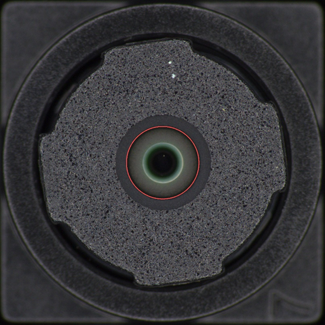

结构命名 
•	Lens_Aperture (镜头孔径)：中心最深处的黑色光学区域（红色框内部）。缺陷特点：一般为缺陷极小的点伤。
•	Lens_Housing (镜头座主体)：由原先的“磨砂支架”与“内衬环”合并而成（红色框外部）。这是指从中心孔径边缘一直延伸到四个定位缺口的整个灰色结构。缺陷特点：划痕、尘埃、脏污；一般面积较大

图像特征与质量
•	分辨率与格式： 文件名为 .bmp 格式，分辨率为 1024x1024。BMP 是无损格式，保留了丰富的细节，适合工业检测。
•	色彩： 图像基本呈中性灰色调，只有镜头中心有微弱的彩色（光学镀膜引起）。
•	光照： 采用了非常均匀的环形光（Ring Light）或同轴光照明，阴影极小，能够清晰地勾勒出零件的轮廓和表面细微的颗粒感。

数据特点（研究对象）
•	检测对象：工业级镜头模组表面（Lens Surface）。
•	图像规格：原始分辨率为 1920*1920 的高分辨率 BMP 图像，具有明显的圆形几何对称结构和精密光学表面特征。
•	核心挑战：缺陷通常为极细微的划痕、尘埃或镀膜不均，这些缺陷在特征空间中与正常背景高度相似（Near-distribution Anomalies），且高分辨率图像对显存和计算效率提出了极高要求。
